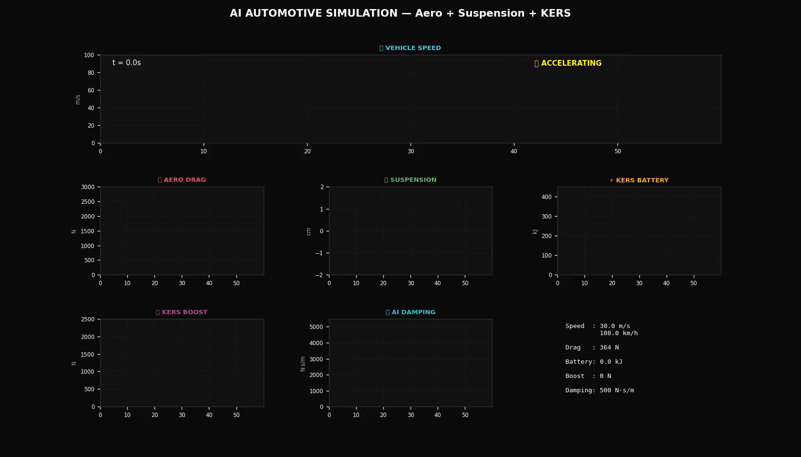
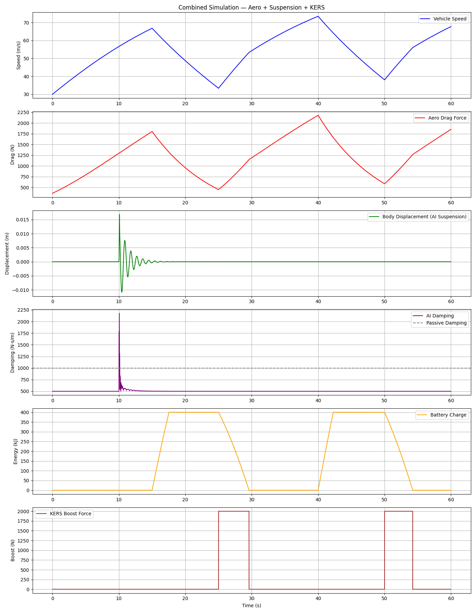

# Combined Automotive Simulation — Aero + Suspension + KERS

A unified physics-based simulation combining three automotive systems into one integrated model.

Built as Phase 4 of my AI-Assisted Automotive Simulations series.

---

## Live Simulation Preview

---

## Static Results

---

## What This Simulates

Three systems working together in every millisecond:

1. AERO — calculates air drag based on speed
2. SUSPENSION — AI PD controller adjusts damping in real-time
3. KERS — captures energy during braking, releases as boost

---

## Parameters

| System | Parameter | Value |
|---|---|---|
| Vehicle | Mass | 1200 kg |
| Aero | Drag Coefficient | 0.30 |
| Aero | Frontal Area | 2.2 m2 |
| Suspension | Spring Stiffness | 16000 N/m |
| Suspension | AI Damping Range | 500 to 5000 N/m |
| KERS | Efficiency | 85 percent |
| KERS | Max Battery | 400 kJ |
| KERS | Max Boost Force | 2000 N |

---

## Drive Cycle

0s to 15s  — Acceleration, engine only
15s to 25s — Braking, KERS capturing energy
25s to 40s — Acceleration, engine plus KERS boost
40s to 50s — Braking, KERS capturing energy
50s to 60s — Acceleration, engine plus KERS boost

---

## Real World Equivalent

Same principles used in Ferrari LaFerrari, McLaren P1, and Formula 1 cars.

---

## Roadmap

- [x] Phase 1 — Aerodynamic Drag Simulator
- [x] Phase 2 — AI Smart Suspension System
- [x] Phase 3 — KERS Energy Recovery System
- [x] Phase 4 — Combined Aero + Suspension + KERS

---

## About

Self-taught simulation developer exploring AI and automotive physics.
Student project — built for learning, not production.

